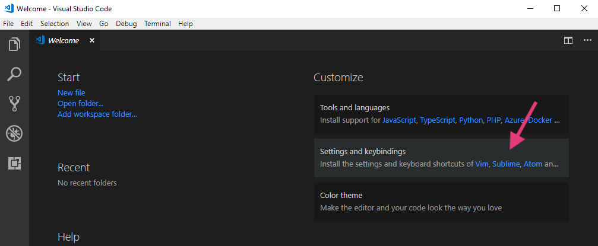
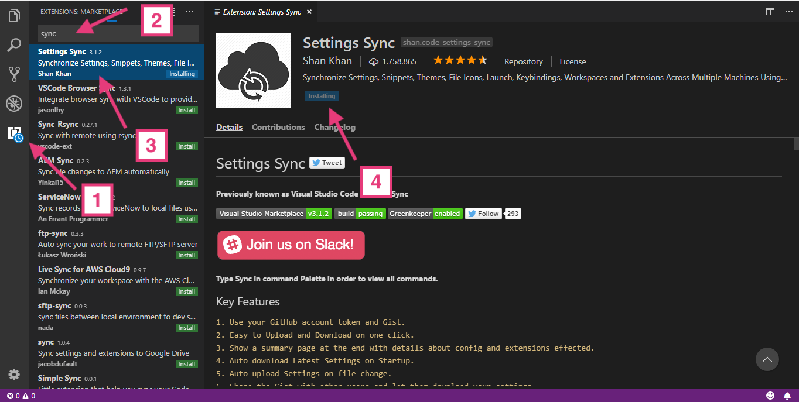
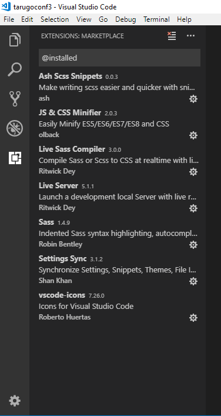

## **ENTORNO DE TRABAJO CON VISUAL STUDIO CODE**

### **Consideraciones previas:**
Os he preparado un gist con la configuración que yo tengo y las extensiones que necesitamos para el taller. Si ya tenéis instalado VSCode, entiendo que ya sabéis como funciona, así que echad un vistazo al gist antes de instalarlo por si mis settings se cargan alguna que tengáis ya vosotros.

El link -> https://gist.github.com/dianaaceves/13c649c74cd66477ea2efdbe4ec741c9

**Las extensiones SÍ QUE LAS NECESITAMOS** esas tenéis que instalarlas, porfi.

Si no lo tenéis instalado, en cuanto lo abrís podéis elegir que os "copie" los settings y keybindings de vuestro editor favorito. (Mola!!!)

### **Instrucciones:**
1. 	**Descarga e instalación de VS Code:**
	https://code.visualstudio.com/Download

2. 	**Instalación de la extensión Settings Sync:**

    Entro en la parte de “Extensiones” (1), escribo en la caja de búsqueda “Sync” (2), la selecciono (3) y le doy a “Install” (4).

	

3. 	Una vez instalada, donde ponía “Install” ahora pone **“Reload”**, le doy para que se reinicie VSCode.

4. 	**Abro la command palette (ctrl+shift+P windows o cmd+shift+p Mac) y ejecuto** (escribo las primeras letras):

	- **Sync : Advance Options > Download Settings from public Gist**  (-> Enter)
	- **Sync : Download Settings** ->
	- Os pide el Gist ID, meted esto: **13c649c74cd66477ea2efdbe4ec741c9**

	Comenzará a descargarse la configuración. Una vez terminado el proceso reinciáis de nuevo
	VSCode y ya deberíais tener tanto los settings como las extensiones.

5. En la caja de búsqueda de la parte de extensiones escribís: **@installed** y eso os
	mostrará las extensiones que tenéis instaladas. Deberían ser estas:

	

